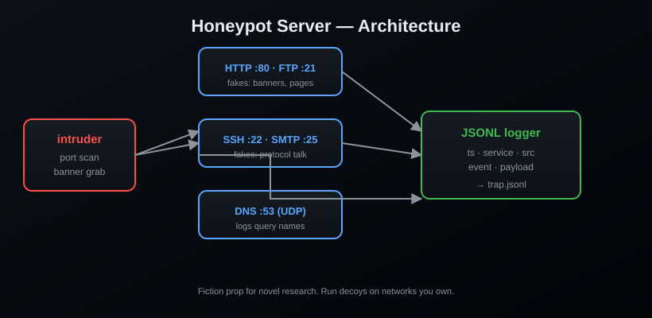

<div align="center">

# 🍯 Honeypot Server


**Fake services that log everyone who knocks.**

[](https://www.python.org/)
[](LICENSE)
[](https://pypi.org/project/honeypot-server/)
[]()

> *"They didn't break in. They just told us they were here."*

</div>

---

## What is it?

A **low-interaction honeypot**: convincing decoys for HTTP, FTP, SSH, SMTP and
DNS that speak just enough of the protocol to look real — and log **every
handshake, banner grab, and probe** to a JSONL file. Watch what rattles around
your network, trip a decoy before the real thing, or write the scene where the
villain's intrusion gets recorded without him knowing.

## Features

- 🖥️ Five decoys: `http`, `ftp`, `ssh`, `smtp`, `dns` (UDP)
- 📝 JSONL logging — timestamp, service, source, payload
- 🧬 Realistic banners and protocol chatter
- 🎛️ Custom ports per service
- 📦 Zero dependencies

## Install

```bash
pip install honeypot-server
```

From source:

```bash
git clone https://github.com/AnonymoDGH/honeypot-server
cd honeypot-server
pip install -e .
```

## Quickstart

```bash
# Deploy decoys on their classic ports, log everything to trap.jsonl
honeypot --services http,ftp,ssh,smtp --log trap.jsonl
# [+] http decoy on 0.0.0.0:80   -> trap.jsonl
# [+] ftp decoy on 0.0.0.0:21    -> trap.jsonl
# [+] ssh decoy on 0.0.0.0:22    -> trap.jsonl
# [+] smtp decoy on 0.0.0.0:25   -> trap.jsonl
# [*] 4 decoys live. Ctrl+C to stop and log out.
```

Now point a scanner at yourself, or wait for the curious. Every knock lands in
the log:

```json
{"ts": "2026-08-13 03:33:33", "service": "http", "src": "192.168.1.50:51234", "event": "data", "data": "GET /admin HTTP/1.1"}
{"ts": "2026-08-13 03:33:34", "service": "ftp", "src": "192.168.1.50:51240", "event": "data", "data": "USER admin"}
```

## CLI reference

| Flag | What it does |
|---|---|
| `--services http,ftp,ssh,smtp` | Which decoys to run |
| `--host 0.0.0.0` | Bind address |
| `--ports http=8080,ssh=2222` | Custom ports |
| `--log trap.jsonl` | JSONL output (default: console) |

## How it works



## Tests

```bash
pip install pytest
pytest
```

## License

[MIT](LICENSE) — a fiction research prop. Run decoys on networks you own and
let the real fun stay in the manuscript.
